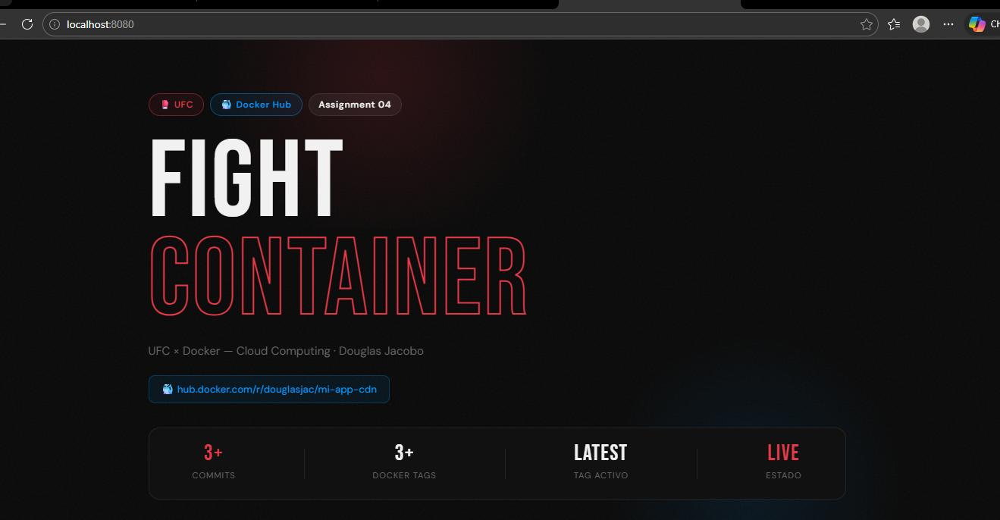
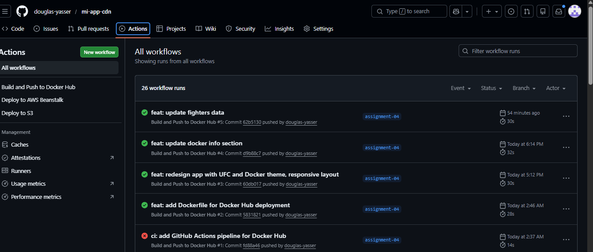
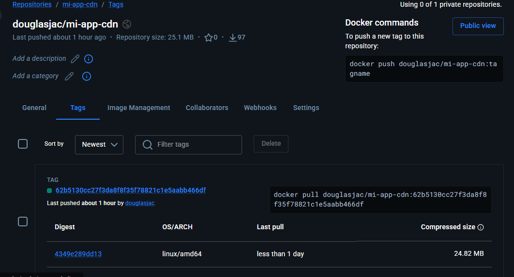
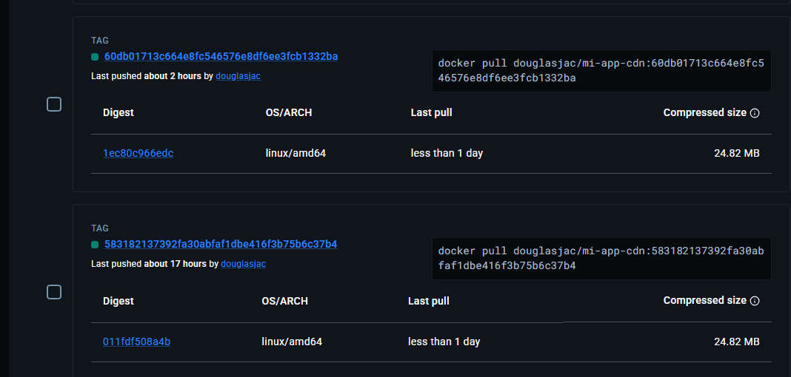

# 🐳 Assignment 04 — Docker Hub Deploy

> **Curso:** Cloud Computing  
> **Rama:** `assignment-04`  
> **Autor:** Douglas Jacobo  
> **Repositorio:** [mi-app-cdn](https://github.com/douglas-yasser/mi-app-cdn)

---

## 📋 Descripción

Aplicación web estática con temática **UFC × Docker**, construida con **React + Vite**, dockerizada y publicada automáticamente en **Docker Hub** mediante un pipeline de **GitHub Actions**. Cada commit genera dos tags: `latest` y el SHA del commit.

---

## 🖥️ Captura de la Aplicación

> 

**Imagen en Docker Hub:**  
🐳 [hub.docker.com/r/douglasjac/mi-app-cdn](https://hub.docker.com/r/douglasjac/mi-app-cdn)

---

## 🛠️ Tecnologías utilizadas

| Tecnología | Uso |
|---|---|
| React + Vite | Framework y build tool |
| Docker + Nginx | Contenedorización y servidor web |
| Docker Hub | Registro de imágenes públicas |
| GitHub Actions | Pipeline CI/CD |
| Doppler | Gestión de secrets |

---

## 🐳 Dockerización

La aplicación usa un **Dockerfile multi-stage**:

1. **Stage 1 (builder):** Instala dependencias y genera el build de producción con Vite.
2. **Stage 2 (nginx):** Sirve los archivos estáticos usando Nginx en el puerto 80.

```dockerfile
FROM node:20-alpine AS builder
WORKDIR /app
COPY package*.json ./
RUN npm install
COPY . .
RUN npm run build

FROM nginx:alpine
COPY --from=builder /app/dist /usr/share/nginx/html
EXPOSE 80
CMD ["nginx", "-g", "daemon off;"]
```

Para correr la imagen localmente:

```bash
docker run -p 8080:80 douglasjac/mi-app-cdn:latest
# Abrir http://localhost:8080
```

---

## 🔐 Gestión de Secrets con Doppler

Las credenciales de Docker Hub son almacenadas en **Doppler** (proyecto `mi-app-cdn-assignment04`) y sincronizadas automáticamente como secrets de GitHub Actions:

| Secret | Descripción |
|---|---|
| `DOCKERHUB_USERNAME` | Usuario de Docker Hub (`douglasjac`) |
| `DOCKERHUB_TOKEN` | Access token generado en Docker Hub |

---

## ⚙️ Pipeline de GitHub Actions

El archivo `.github/workflows/dockerhub.yml` se dispara en cada push a `assignment-04` y realiza:

1. **Checkout** del código fuente.
2. **Login a Docker Hub** usando los secrets de GitHub.
3. **Build de la imagen Docker**.
4. **Push con dos tags:**
   - `douglasjac/mi-app-cdn:latest` — siempre apunta a la versión más reciente.
   - `douglasjac/mi-app-cdn:<SHA>` — tag único por commit para trazabilidad.

```yaml
tags: |
  douglasjac/mi-app-cdn:latest
  douglasjac/mi-app-cdn:${{ github.sha }}
```

### Evidencia de ejecución exitosa

> 

---

## 🏷️ Tags en Docker Hub

Cada commit genera automáticamente dos tags. Las imágenes previas conservan únicamente su SHA, mientras que la más reciente tiene ambos tags.

| Tag | Descripción |
|---|---|
| `latest` | Imagen más reciente |
| `<sha-commit-1>` | Primer commit |
| `<sha-commit-2>` | Segundo commit |
| `<sha-commit-3>` | Tercer commit |

### Capturas de Docker Hub

> 
  

---

## 📁 Estructura del proyecto

```
mi-app-cdn/
├── .github/
│   └── workflows/
│       └── dockerhub.yml       # Pipeline Docker Hub
├── src/
│   ├── App.jsx
│   ├── App.css
│   ├── main.jsx
│   └── index.css
├── public/
├── .dockerignore
├── .gitignore
├── Dockerfile
├── index.html
├── package.json
├── README.md
└── vite.config.js
```

---

## 🚀 Cómo ejecutar localmente

```bash
# Instalar dependencias
npm install

# Modo desarrollo
npm run dev

# Build de producción
npm run build

# Ejecutar con Docker
docker run -p 8080:80 douglasjac/mi-app-cdn:latest
# Abrir http://localhost:8080
```

---

## 📝 Formato de commits utilizado

```
feat: nueva funcionalidad
fix: corrección de errores
ci: cambios en pipeline
docs: actualización de documentación
chore: tareas de mantenimiento
```