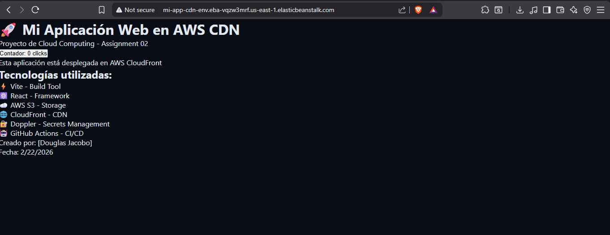

# 🚀 Assignment 03 — AWS Elastic Beanstalk Deploy

> **Curso:** Cloud Computing  
> **Rama:** `assignment-03`  
> **Autor:** Douglas Yasser  
> **Repositorio:** [mi-app-cdn](https://github.com/douglas-yasser/mi-app-cdn)

---

## 📋 Descripción

Aplicación web estática construida con **React + Vite**, dockerizada y desplegada automáticamente en **AWS Elastic Beanstalk** mediante un pipeline de **GitHub Actions**. Las credenciales de AWS son gestionadas de forma segura a través de **Doppler**, sincronizadas automáticamente con los secrets de GitHub.

---

## 🖥️ Captura de la Aplicación


**URL de producción:**  
🌐 [http://mi-app-cdn-env.eba-vqzw3mrf.us-east-1.elasticbeanstalk.com](http://mi-app-cdn-env.eba-vqzw3mrf.us-east-1.elasticbeanstalk.com)

---

## 🛠️ Tecnologías utilizadas

| Tecnología            | Uso                              |
| --------------------- | -------------------------------- |
| React + Vite          | Framework y build tool           |
| Docker + Nginx        | Contenedorización y servidor web |
| AWS Elastic Beanstalk | Plataforma de despliegue         |
| AWS ECR               | Registro de imágenes Docker      |
| GitHub Actions        | Pipeline CI/CD                   |
| Doppler               | Gestión de secrets               |
| Husky + lint-staged   | Control de calidad pre-commit    |
| ESLint + Prettier     | Linting y formateo de código     |

---

## 🐶 Uso de Husky

**Husky** es una herramienta que permite ejecutar scripts automáticamente en distintos momentos del flujo de Git (llamados _Git hooks_). En este proyecto se configuró el hook `pre-commit`, que se ejecuta **antes de cada commit**.

### ¿Cómo funciona?

Cuando se ejecuta `git commit`, Husky intercepta el proceso y corre **lint-staged**, que aplica las siguientes validaciones únicamente sobre los archivos que están en el área de staging (los modificados):

- **ESLint** — detecta y corrige errores de JavaScript/JSX automáticamente.
- **Prettier** — formatea el código para mantener un estilo consistente.

Si alguna de estas validaciones falla, **el commit es bloqueado** hasta que se corrijan los errores, garantizando que el código que llega al repositorio siempre cumpla con los estándares de calidad definidos.

### Configuración aplicada

**`.husky/pre-commit`:**

```bash
npx lint-staged
```

**`package.json` (sección lint-staged):**

```json
"lint-staged": {
  "**/*.{js,jsx,ts,tsx}": [
    "eslint --fix",
    "prettier --write"
  ],
  "**/*.{css,html,json,md}": [
    "prettier --write"
  ]
}
```

**`.prettierrc`:**

```json
{
  "semi": true,
  "singleQuote": true,
  "tabWidth": 2
}
```

### Evidencia de funcionamiento

Al hacer un commit, Husky ejecuta lint-staged automáticamente:

```
✔ Backed up original state in git stash
✔ Running tasks for staged files...
✔ Applying modifications from tasks...
✔ Cleaning up temporary files...
[assignment-03 e830ba8] feat: configure Husky with lint-staged and Prettier
```

---

## 🐳 Dockerización

La aplicación usa un **Dockerfile multi-stage**:

1. **Stage 1 (builder):** Instala dependencias y genera el build de producción con Vite.
2. **Stage 2 (nginx):** Sirve los archivos estáticos del build usando Nginx en el puerto 80.

```dockerfile
FROM node:20-alpine AS builder
WORKDIR /app
COPY package*.json ./
RUN npm install
COPY . .
RUN npm run build

FROM nginx:alpine
COPY --from=builder /app/dist /usr/share/nginx/html
EXPOSE 80
CMD ["nginx", "-g", "daemon off;"]
```

---

## 🔐 Gestión de Secrets con Doppler

Las credenciales de AWS (`AWS_ACCESS_KEY_ID` y `AWS_SECRET_ACCESS_KEY`) son almacenadas en **Doppler** y sincronizadas automáticamente como secrets de GitHub Actions, evitando exponer credenciales en el repositorio.

Secrets sincronizados:

- `AWS_ACCESS_KEY_ID`
- `AWS_SECRET_ACCESS_KEY`
- `AWS_REGION`

---

## ⚙️ Pipeline de GitHub Actions

El archivo `.github/workflows/beanstalk.yml` define el pipeline que se dispara en cada push a `assignment-03` y realiza los siguientes pasos:

1. **Checkout** del código fuente.
2. **Configuración de credenciales AWS** usando los secrets de GitHub.
3. **Login a Amazon ECR** para poder subir imágenes Docker.
4. **Build y push** de la imagen Docker al repositorio ECR.
5. **Generación del `Dockerrun.aws.json`** que referencia la imagen en ECR.
6. **Deploy a Elastic Beanstalk** usando la acción `beanstalk-deploy`.

### Evidencia de ejecución exitosa

> _Agregar aquí captura del pipeline exitoso en GitHub Actions_

```
Status: Success
Total duration: 1m 48s
```

---

## ☁️ Configuración de AWS Elastic Beanstalk

### Detalles del entorno

| Parámetro         | Valor                                           |
| ----------------- | ----------------------------------------------- |
| Aplicación        | `mi-app-cdn`                                    |
| Entorno           | `Mi-app-cdn-env`                                |
| Plataforma        | Docker running on 64bit Amazon Linux 2023/4.9.3 |
| Región            | `us-east-1` (N. Virginia)                       |
| Tipo              | Instancia única (Free Tier)                     |
| Tipo de instancia | `t3.micro`                                      |

### URL del entorno

🌐 [http://mi-app-cdn-env.eba-vqzw3mrf.us-east-1.elasticbeanstalk.com](http://mi-app-cdn-env.eba-vqzw3mrf.us-east-1.elasticbeanstalk.com)

### Capturas de pantalla


---

## 📁 Estructura del proyecto

```
mi-app-cdn/
├── .github/
│   └── workflows/
│       ├── deploy.yml          # Pipeline S3 (assignment-02)
│       └── beanstalk.yml       # Pipeline Beanstalk (assignment-03)
├── .husky/
│   └── pre-commit              # Hook pre-commit
├── src/
│   ├── App.jsx
│   ├── App.css
│   ├── main.jsx
│   └── index.css
├── public/
├── .dockerignore
├── .gitignore
├── .prettierrc
├── Dockerfile
├── eslint.config.js
├── index.html
├── package.json
├── README.md
└── vite.config.js
```

---

## 🚀 Cómo ejecutar localmente

```bash
# Instalar dependencias
npm install

# Modo desarrollo
npm run dev

# Build de producción
npm run build

# Ejecutar con Docker
docker build -t mi-app-cdn .
docker run -p 8080:80 mi-app-cdn
# Abrir http://localhost:8080
```

---

## 📝 Formato de commits utilizado

```
feat: nueva funcionalidad
fix: corrección de errores
ci: cambios en pipeline
docs: actualización de documentación
chore: tareas de mantenimiento
```
