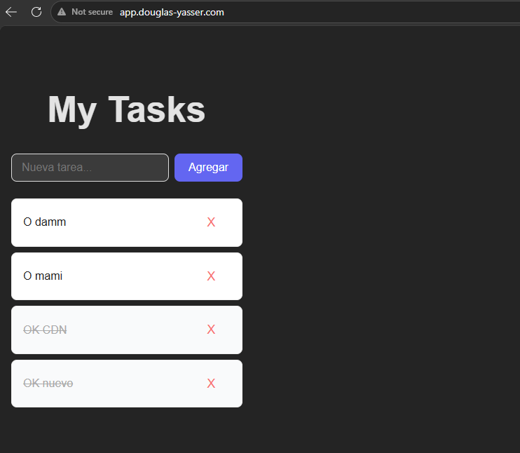
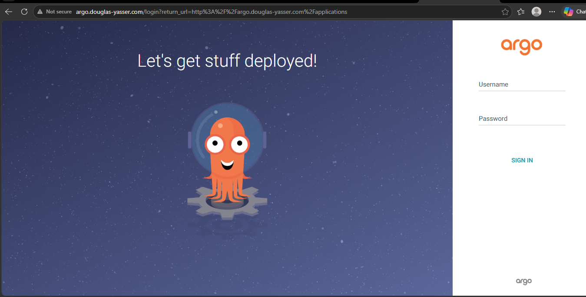
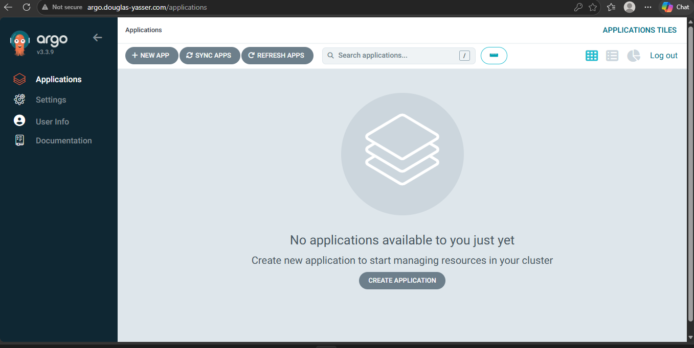

#  Assignment 08 — Kubernetes Cluster con Minikube

Clúster de Kubernetes local configurado con Minikube, Traefik como Ingress Controller, ArgoCD para GitOps y la aplicación To-Do List del assignment anterior desplegada con IaC completa.

---

##  Capturas de pantalla

### Aplicación To-Do — http://app.douglas-yasser.com

### ArgoCD — http://argo.douglas-yasser.com

---

##  Dominios configurados

| Servicio | URL |
|---|---|
| **Frontend (To-Do App)** | http://app.douglas-yasser.com |
| **Backend API** | http://api.douglas-yasser.com |
| **ArgoCD Dashboard** | http://argo.douglas-yasser.com |

---

## Configuración DNS local

Los dominios fueron configurados localmente editando el archivo de hosts del sistema operativo:

**Windows:** C:\Windows\System32\drivers\etc\hosts

**Linux/Mac:** /etc/hosts

\\\
127.0.0.1 app.douglas-yasser.com
127.0.0.1 api.douglas-yasser.com
127.0.0.1 argo.douglas-yasser.com
\\\

Esta configuración permite que Traefik maneje las rutas internamente sin necesidad de un DNS externo, simulando un entorno de producción real.

---

##  Arquitectura del Clúster

\\\
Minikube Cluster
├── namespace: traefik
│   └── Traefik (Ingress Controller) — LoadBalancer en 127.0.0.1
├── namespace: argocd
│   ├── ArgoCD Server (--insecure)
│   └── IngressRoute → argo.douglas-yasser.com
└── namespace: todo-app
    ├── todo-frontend (React + Nginx)
    │   └── IngressRoute → app.douglas-yasser.com
    └── todo-backend (Node.js + Express)
        └── IngressRoute → api.douglas-yasser.com
\\\

---

## Stack Tecnológico

| Componente | Tecnología |
|---|---|
| **Clúster local** | Minikube v1.38 con driver Docker |
| **Ingress Controller** | Traefik v3 (Helm) |
| **GitOps** | ArgoCD |
| **Frontend** | React 19 + Vite 7 + Nginx |
| **Backend** | Node.js + Express |
| **Base de datos** | PostgreSQL (Railway) |
| **Migraciones** | Knex.js |
| **Documentación API** | Swagger / OpenAPI 3.0 |

---

## Estructura IaC (Manifiestos YAML)

\\\
k8s/
├── traefik/
│   ├── traefik.yaml           # Configuración Helm de Traefik
│   └── traefik-config.yaml    # Cross-namespace config
├── argocd/
│   └── ingressroute.yaml      # IngressRoute para ArgoCD
└── app/
    ├── namespace.yaml          # Namespace todo-app
    ├── backend-deployment.yaml # Deployment + Service del backend
    ├── frontend-deployment.yaml # Deployment + Service del frontend
    └── ingressroute.yaml       # IngressRoutes de la app
\\\

---

##  Comandos para levantar todo desde cero

### 1. Iniciar el clúster

\\\ash
minikube start --driver=docker --cpus=4 --memory=4096
\\\

### 2. Instalar Traefik

\\\ash
helm repo add traefik https://helm.traefik.io/traefik
helm repo update
kubectl create namespace traefik
helm install traefik traefik/traefik \
  --namespace traefik \
  --set service.type=LoadBalancer \
  --set providers.kubernetesCRD.allowCrossNamespace=true
\\\

### 3. Instalar ArgoCD

\\\ash
kubectl create namespace argocd
kubectl apply -n argocd -f https://raw.githubusercontent.com/argoproj/argo-cd/stable/manifests/install.yaml

# Configurar en modo inseguro (HTTP)
kubectl patch deployment argocd-server -n argocd --patch-file patch-argo.yaml
\\\

### 4. Construir imágenes Docker dentro de Minikube

\\\ash
# Apuntar Docker al daemon de Minikube
minikube docker-env | Invoke-Expression   # Windows
eval \$Env:DOCKER_TLS_VERIFY = "1" $Env:DOCKER_HOST = "tcp://127.0.0.1:62977" $Env:DOCKER_CERT_PATH = "C:\Users\DOUGLAS\.minikube\certs" $Env:MINIKUBE_ACTIVE_DOCKERD = "minikube" # To point your shell to minikube's docker-daemon, run: # & minikube -p minikube docker-env --shell powershell | Invoke-Expression              # Linux/Mac

# Construir imágenes
docker build -t todo-frontend:latest .
docker build -t todo-backend:latest -f apps/backend/Dockerfile .
\\\

### 5. Aplicar manifiestos

\\\ash
kubectl apply -f k8s/app/namespace.yaml
kubectl apply -f k8s/app/backend-deployment.yaml
kubectl apply -f k8s/app/frontend-deployment.yaml
kubectl apply -f k8s/app/ingressroute.yaml
kubectl apply -f k8s/argocd/ingressroute.yaml
\\\

### 6. Exponer Traefik con tunnel

\\\ash
minikube tunnel
\\\

### 7. Configurar DNS local (como Administrador)

\\\ash
# Windows PowerShell (como Administrador)
Add-Content C:\Windows\System32\drivers\etc\hosts "127.0.0.1 app.douglas-yasser.com"
Add-Content C:\Windows\System32\drivers\etc\hosts "127.0.0.1 api.douglas-yasser.com"
Add-Content C:\Windows\System32\drivers\etc\hosts "127.0.0.1 argo.douglas-yasser.com"
\\\

---

## Acceso a ArgoCD

| Campo | Valor |
|---|---|
| **URL** | http://argo.douglas-yasser.com |
| **Usuario** | admin |
| **Contraseña** | Obtener con el comando: |

\\\ash
kubectl get secret argocd-initial-admin-secret -n argocd \
  -o jsonpath="{.data.password}" | base64 -d
\\\

---

## Endpoints de la API

| Método | Endpoint | Descripción |
|---|---|---|
| GET | /api/tasks | Obtiene todas las tareas |
| POST | /api/tasks | Crea una nueva tarea |
| PATCH | /api/tasks/:id | Actualiza el estado de una tarea |
| DELETE | /api/tasks/:id | Elimina una tarea |
| GET | /health | Health check |
| GET | /api-docs | Documentación Swagger |

---

##  Autor

**Douglas Yasser**
Repositorio: [github.com/douglas-yasser/mi-app-cdn](https://github.com/douglas-yasser/mi-app-cdn)
Rama: assignment-08
