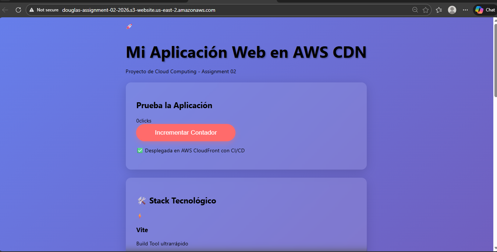

# 🚀 Assignment 02 -- Web App Deployment using AWS CDN

## 📌 Descripción del Proyecto

Esta es una aplicación web estática desarrollada como parte del curso de
Cloud Computing. El objetivo fue desplegar la aplicación utilizando un
CDN en AWS, automatizando el proceso mediante CI/CD.

La aplicación fue desarrollada con React y Vite, y es desplegada
automáticamente en AWS S3 y distribuida mediante CloudFront.

------------------------------------------------------------------------

## 🛠️ Tecnologías Utilizadas

-   React
-   Vite
-   Amazon S3
-   Amazon CloudFront (CDN)
-   Doppler (Gestión de secretos)
-   GitHub Actions (CI/CD)

------------------------------------------------------------------------

## 🏗️ Arquitectura del Proyecto

Flujo de despliegue:

Developer → GitHub → GitHub Actions → Build → S3 → CloudFront → Usuario
Final

### Descripción del flujo:

1.  El desarrollador realiza cambios y hace push a la rama
    `assignment-02`.
2.  GitHub Actions ejecuta el pipeline automáticamente.
3.  Se ejecuta el build del proyecto generando la carpeta `dist/`.
4.  El contenido de `dist/` se sube al bucket de Amazon S3.
5.  Se invalida la caché de CloudFront.
6.  Los usuarios acceden a la aplicación a través del CDN.

------------------------------------------------------------------------

## 🔄 Pipeline de GitHub Actions

El pipeline realiza automáticamente:

-   ✅ Build del proyecto con Vite
-   ✅ Upload del contenido `dist/` al bucket S3
-   ✅ Invalidation del CDN de CloudFront

Ubicación del pipeline:

.github/workflows/deploy.yml

------------------------------------------------------------------------

## 🔐 Gestión de Secretos con Doppler

Las credenciales necesarias para el despliegue fueron almacenadas en un
proyecto de Doppler específico para esta actividad.

Doppler se encuentra integrado con el repositorio de GitHub mediante
Config Sync, lo que permite actualizar automáticamente los secretos en
GitHub Actions.

Secrets utilizados:

-   AWS_ACCESS_KEY_ID
-   AWS_SECRET_ACCESS_KEY
-   AWS_REGION
-   S3_BUCKET_NAME

------------------------------------------------------------------------

## 🌐 URL Pública del CDN

🔗 URL de acceso público mediante CloudFront:

\[http://douglas-assignment-02-2026.s3-website.us-east-2.amazonaws.com\]

------------------------------------------------------------------------

## 📸 Evidencias

### 1️⃣ Config Sync en Doppler

()

### 2️⃣ Variables configuradas en Doppler

()

### 3️⃣ Secrets en GitHub

()

### 4️⃣ Aplicación funcionando

()

------------------------------------------------------------------------

## 📊 Cumplimiento de Requisitos

✔ Proyecto configurado con Vite\
✔ Generación de carpeta `dist/`\
✔ Pipeline automatizado en GitHub Actions\
✔ Secrets gestionados con Doppler\
✔ CDN funcional mediante CloudFront\
✔ Múltiples commits en la rama `assignment-02`

------------------------------------------------------------------------

## 👨‍💻 Autor

Douglas Yasser\
Curso de arquitectura de sistemas II\
Assignment 02
