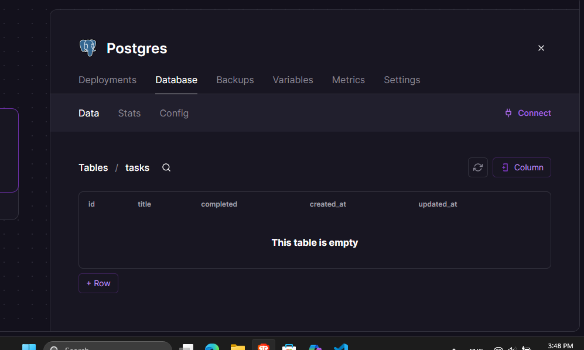

# 📝 Mi App CDN — Assignment 05

Aplicación web full stack de gestión de tareas (To-Do List), desarrollada como monorepo con frontend, backend y base de datos desplegados en la nube.

---

## URLs de Producción

| Servicio | URL |
|---|---|
| **Frontend** | https://monorepo-five-beta.vercel.app |
| **Backend** | https://mi-app-cdn-production.up.railway.app |
| **API Docs** | https://mi-app-cdn-production.up.railway.app/api-docs |

---

##  Arquitectura

Este proyecto está configurado como un **monorepo** usando npm workspaces, con los siguientes servicios:
```
mi-app-cdn/
├── apps/
│   ├── frontend/     # Vite + React
│   └── backend/      # Node.js + Express
├── package.json      # Raíz del monorepo
└── README.md
```

---

## Stack Tecnológico

### Frontend
- **Framework:** React 19 + Vite 7
- **Deploy:** Vercel
- **Variables de entorno:** Doppler → Vercel

### Backend
- **Runtime:** Node.js
- **Framework:** Express
- **ORM / Migraciones:** Knex.js
- **Documentación:** Swagger / OpenAPI 3.0
- **Deploy:** Railway

### Base de Datos
- **Motor:** PostgreSQL
- **Host:** Railway
- **Migraciones:** Knex

### Gestión de Secretos
- **Herramienta:** Doppler
- **Integración:** Sincronización automática con Railway

---

##  Estructura de la Base de Datos

La siguiente migración crea la tabla principal de la aplicación:
```js
// 20240101_create_tasks.js
exports.up = function(knex) {
  return knex.schema.createTable('tasks', table => {
    table.increments('id').primary();
    table.string('title').notNullable();
    table.boolean('completed').defaultTo(false);
    table.timestamps(true, true);
  });
};
```

### Captura de pantalla — Base de datos en Railway



---

##  Endpoints de la API

| Método | Endpoint | Descripción |
|---|---|---|
| `GET` | `/api/tasks` | Obtiene todas las tareas |
| `POST` | `/api/tasks` | Crea una nueva tarea |
| `PATCH` | `/api/tasks/:id` | Actualiza el estado de una tarea |
| `DELETE` | `/api/tasks/:id` | Elimina una tarea |
| `GET` | `/health` | Health check del servidor |
| `GET` | `/api-docs` | Documentación Swagger |

La documentación interactiva completa está disponible en:
```
https://mi-app-cdn-production.up.railway.app/api-docs
```

---

##  Variables de Entorno

Las variables de entorno son gestionadas con **Doppler** y sincronizadas automáticamente con Railway.

### Backend
| Variable | Descripción |
|---|---|
| `DATABASE_URL` | Connection string de PostgreSQL |
| `PORT` | Puerto del servidor |
| `BACKEND_URL` | URL pública del backend |

### Frontend
| Variable | Descripción |
|---|---|
| `VITE_API_URL` | URL del backend para las peticiones |

---

##  Correr el proyecto localmente

### Requisitos
- Node.js 18+
- npm 9+

### Instalación
```bash
# Clonar el repositorio
git clone https://github.com/douglas-yasser/mi-app-cdn.git
cd mi-app-cdn
git checkout assignment-05

# Instalar dependencias
npm install

# Crear archivo .env en apps/backend
echo "DATABASE_URL=tu_database_url" > apps/backend/.env
echo "PORT=3001" >> apps/backend/.env

# Correr migraciones
cd apps/backend && npx knex migrate:latest

# Correr frontend y backend
npm run dev:frontend
npm run dev:backend
```

---

## 📝 Convención de Commits

Este proyecto sigue el estándar de **Conventional Commits**:

| Prefijo | Uso |
|---|---|
| `feat:` | Nueva funcionalidad |
| `fix:` | Corrección de errores |
| `docs:` | Cambios en documentación |
| `chore:` | Tareas de mantenimiento |

---

##  Autor

**Douglas Yasser**  
Repositorio: [github.com/douglas-yasser/mi-app-cdn](https://github.com/douglas-yasser/mi-app-cdn)